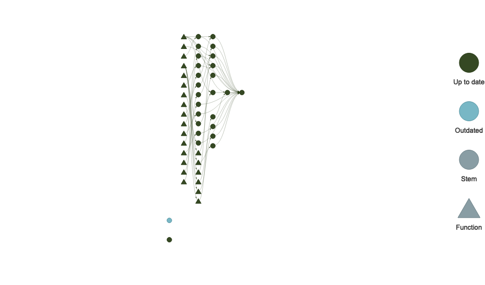
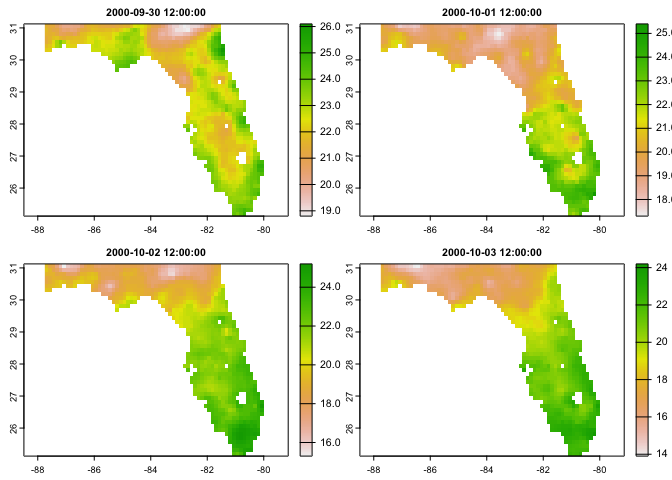

<!-- README.md is generated from README.Rmd. Please edit that file -->

# WIP: climateR-catalogs

<!-- badges: start -->
<!-- badges: end -->

The goal of `climateR-catalogs` is to build data catalogs usable with
`terra`, `climateR`, `gdalio`, `opendap.catalog`, `geoknife`, `stars`
ect.

The catalog(s) will be built using `targets` in this repo, and deployed
as JSON artifacts at
“<https://mikejohnson51.github.io/climateR-catalogs/catalog.json>”.
Hopefully a more authorative home at USGS or NOAA can be found to host
these.

## Targets

See interactive version
[here](https://mikejohnson51.github.io/climateR-catalogs/)

<!-- -->

### Today:

The catalog looks like this on 2022-08-12:

``` r
cat =  fromJSON("docs/catalog.json", simplifyDataFrame = TRUE)

# Unique datasets
nrow(cat)
#> [1] 3151

# Unique sources
length(unique(cat$source))  + length(unique(cat$id))  
#> [1] 16
```

### Examples

Here is a minimal example with the base information added:

``` r
pacman::p_load(jsonlite, dplyr, opendap.catalog, AOI, terra)

url = "https://mikejohnson51.github.io/climateR-catalogs/catalog.json"

cat = fromJSON(url, simplifyDataFrame = TRUE) %>% 
  filter(description == "NLCD Land_Cover L48 2019")

t(cat)
#>             [,1]                                                                                                 
#> source      NA                                                                                                   
#> product     "USGS NLCD Land Cover"                                                                               
#> URL         "/vsicurl/https://storage.googleapis.com/feddata-r/nlcd/2019_Land_Cover_L48.tif"                     
#> units       NA                                                                                                   
#> description "NLCD Land_Cover L48 2019"                                                                           
#> X1          "-2493045"                                                                                           
#> Xn          "2342655"                                                                                            
#> Y1          "-2493045"                                                                                           
#> Yn          "3310005"                                                                                            
#> resX        "30"                                                                                                 
#> resY        "30"                                                                                                 
#> ncols       "161190"                                                                                             
#> nrows       "104424"                                                                                             
#> proj        "+proj=aea +lat_0=23 +lon_0=-96 +lat_1=29.5 +lat_2=45.5 +x_0=0 +y_0=0 +datum=WGS84 +units=m +no_defs"
#> id          NA                                                                                                   
#> varname     NA                                                                                                   
#> variable    NA                                                                                                   
#> model       NA                                                                                                   
#> ensemble    NA                                                                                                   
#> scenario    NA                                                                                                   
#> X_name      NA                                                                                                   
#> Y_name      NA                                                                                                   
#> T_name      NA                                                                                                   
#> long_name   NA                                                                                                   
#> duration    NA                                                                                                   
#> interval    NA                                                                                                   
#> nT          NA                                                                                                   
#> toptobottom NA                                                                                                   
#> tiled       NA
```

``` r
(output   = dap(catalog = cat,  AOI = aoi_get("Fort Collins")))
#> class       : SpatRaster 
#> dimensions  : 667, 548, 1  (nrow, ncol, nlyr)
#> resolution  : 30, 30  (x, y)
#> extent      : -768615, -752175, 1975575, 1995585  (xmin, xmax, ymin, ymax)
#> coord. ref. : Albers Conical Equal Area 
#> source      : memory 
#> color table : 1 
#> categories  : NLCD Land Cover Class, Histogram, Red, Green, Blue, Opacity 
#> name        :        NLCD Land Cover Class 
#> min value   :                   Open Water 
#> max value   : Emergent Herbaceous Wetlands

plot(output)
```

<!-- -->

This is still a little clunky but you can pass multi-row “catalog”
data.frames straight to dap! For example say you want soil sand content,
land cover and elevation for the city of Fort Collins:

``` r
cat = fromJSON("docs/catalog.json", simplifyDataFrame = TRUE) %>% 
  filter(description == c("NLCD Land_Cover L48 2019") |
         product %in% c("mean sand 0-5cm", "30m CONUS DEM"))


output  = lapply(1:nrow(cat), function(x){   dap(catalog = cat[x,],  
                                         AOI = aoi_get("Fort Collins")) })

par(mfrow = c(2,2))
for(i in 1:3){
  plot(output[[i]], main = cat$product[i])  
}  
```

<!-- -->

### Hitting OpenDap resources!

``` r
cat = fromJSON("docs/catalog.json", simplifyDataFrame = TRUE) %>% 
  filter(id == 'bcca', 
         variable  ==   'tasmin',   
         model == 'MPI-ESM-LR', 
         ensemble == 'r1i1p1',
         scenario == "historical") 

t(cat)
#>             [,1]                                                            
#> source      NA                                                              
#> product     NA                                                              
#> URL         "https://cida.usgs.gov/thredds/dodsC/cmip5_bcca/historical"     
#> units       "C"                                                             
#> description NA                                                              
#> X1          "-124.6875"                                                     
#> Xn          "-67.0625"                                                      
#> Y1          "25.1875"                                                       
#> Yn          "52.8125"                                                       
#> resX        "0.125"                                                         
#> resY        "0.125"                                                         
#> ncols       "462"                                                           
#> nrows       "222"                                                           
#> proj        "+proj=longlat +a=6378137 +f=0.00335281066474748 +pm=0 +no_defs"
#> varname     "BCCA_0-125deg_tasmin_day_MPI-ESM-LR_historical_r1i1p1"         
#> variable    "tasmin"                                                        
#> depth       NA                                                              
#> measure     NA                                                              
#> id          "bcca"                                                          
#> model       "MPI-ESM-LR"                                                    
#> ensemble    "r1i1p1"                                                        
#> scenario    "historical"                                                    
#> X_name      "longitude"                                                     
#> Y_name      "latitude"                                                      
#> T_name      "time"                                                          
#> long_name   "Daily Minimum Near-Surface Air Temperature"                    
#> duration    "1950-01-01 12:00:00/2005-12-31 12:00:00"                       
#> interval    "1 days"                                                        
#> nT          "20454"                                                         
#> toptobottom "TRUE"                                                          
#> tiled       "T"

data = dap(URL  = cat$URL, 
           AOI = aoi_get(state = "FL"), 
           varname = cat$varname,
           startDate = "2000-10-01",
           endDate   = "2000-10-04")
#> source:   https://cida.usgs.gov/thredds/dodsC/cmip5_bcca/historical 
#> varname(s):
#>    > BCCA_0-125deg_tasmin_day_MPI-ESM-LR_historical_r1i1p1 [C] (Daily Minimum Near-Surface Air Temperature)
#> ==================================================
#> diminsions:  63, 48, 4 (names: longitude,latitude,time)
#> resolution:  0.125, 0.125, 1 days
#> extent:      -87.75, -79.88, 25.12, 31.12 (xmin, xmax, ymin, ymax)
#> crs:         +proj=longlat +a=6378137 +f=0.00335281066474748 +p...
#> time:        2000-09-30 12:00:00 to 2000-10-03 12:00:00
#> ==================================================
#> values: 12,096 (vars*X*Y*T)

plot(data[[1]])
```

<!-- -->
